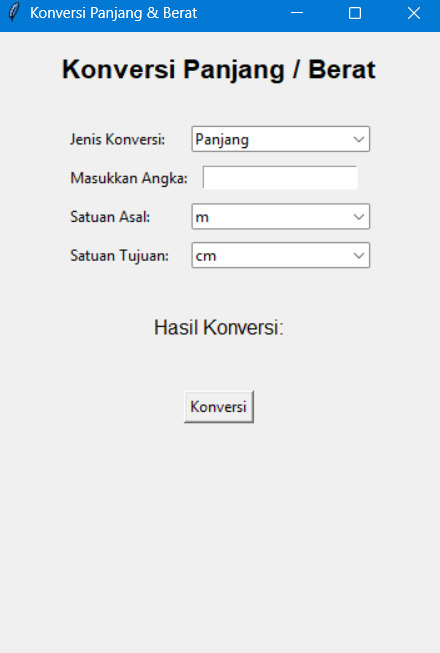

# Konverter Panjang & Berat

A simple but useful unit converter app made with Python and Tkinter.

Convert between different metric units for **length** and **mass** using an intuitive graphical interface.

# Features

- Convert legnth units: `mm`, `cm`, `dm`, `m`, `dam`, `hm`, `km`
- Convert mass units: `mg`, `cg`, `dg`, `g`, `dag`, `hg`, `kg`

# Screenshot

